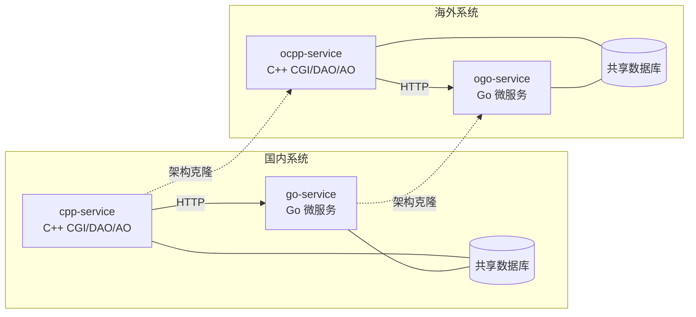

# 平台架构总览

医疗/药房 SaaS 平台，分**国内版**和**海外版**两套独立系统。每套系统由 C++（CGI/DAO/AO）和 Go（go-micro 微服务）两个仓库组成，共享同一套业务数据库。

## 四仓库映射

| 标识 | 语言 | 版本 | 本地路径 | 详情 |
|------|------|------|----------|------|
| cpp-service | C++ | 国内 | `cpp-code\code\cpp-service` | [[cpp-service]] |
| go-service | Go | 国内 | `go-code\code\go-service` | [[go-service]] |
| ocpp-service | C++ | 海外 | `cpp-code\code\ocpp-service` | [[ocpp-service]] |
| ogo-service | Go | 海外 | `go-code\code\ogo-service` | [[ogo-service]] |

## 配对关系



- **国内系统**：[[cpp-service]] + [[go-service]] — 共享业务数据库，C++ 通过 HTTP 调用 Go API
- **海外系统**：[[ocpp-service]] + [[ogo-service]] — 同上，独立部署，业务有差异
- 国内/海外架构相同，海外是国内的克隆体；代码可参考但不能直接混用

## 跨语言调用链

```
C++ CGI (web/) → HTTP → Go API handler → gRPC → Go SRV handler → MySQL
C++ AO (.so)  → HTTP → Go API handler → gRPC → Go SRV handler → MySQL
```

Go 侧被调用的接口由 proto 定义，C++ 侧通过 curl/HTTP 发起请求。

## 测试服务器

所有服务器统一端口 36000，用户 guanbin。

| 项目 | 服务器 | SSH |
|------|--------|-----|
| [[cpp-service]] | 172.30.12.124 | `ssh -p 36000 guanbin@172.30.12.124` |
| [[go-service]] | 172.30.12.14 | `ssh -p 36000 guanbin@172.30.12.14` |
| [[ocpp-service]] | 172.30.12.165 | `ssh -p 36000 guanbin@172.30.12.165` |
| [[ogo-service]] | 172.30.12.166 | `ssh -p 36000 guanbin@172.30.12.166` |

### 日志路径

| 语言 | 层 | 路径 |
|------|-----|------|
| C++ | CGI (web/) | `/data/c2c_logs/*_debug*.log` |
| C++ | DAO / AO | `/data/applog/*_debug*.log` |
| Go | srv | `/data/srv/` |
| Go | api | `/data/api/` |

> [!warning] 服务器访问权限
> 只允许只读查看日志和运行结果，**禁止在服务器上做任何修改操作**。

## CLAUDE.md 体系

```
~/.claude/CLAUDE.md              ← 全局（所有项目自动加载）
<project>/CLAUDE.md              ← 项目级（只在对应项目加载）
<project>/<subdir>/CLAUDE.md     ← 子模块级
```

- 全局文件包含：四仓库映射、测试服务器、跨项目协作规则、日志路径
- 各项目文件包含：构建方式、架构细节、编码规范、业务模块说明

## 开发约束

- 本机 Windows 只做代码编辑，不做编译/构建
- 流程：本地编辑 → git push → 服务器 pull → 编译部署
- 未经明确允许不得执行任何 git push

## 跨项目联动改动规则

1. 确认涉及哪些仓库（同一版本：国内 or 海外）
2. 先改 Go 侧 proto 定义 → Go handler 实现
3. 再改 C++ 侧 HTTP 调用代码
4. 如果涉及数据库变更，两边 `db_sql/` 都要同步
